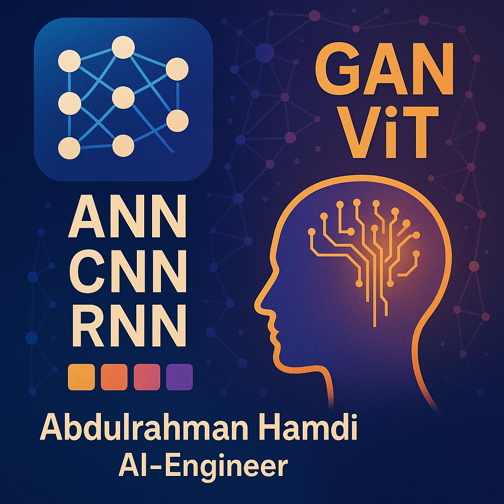

  

<h1 align="center">👋 Hi, I'm Abdulrahman Hamdi</h1>

  <b>Computer & AI Engineer | Full-Stack Developer | Deep Learning Enthusiast</b>

  🎓 Honours Graduate (Ranked 1st) – <b>Sivas Cumhuriyet University</b> 
  💡 Passionate about AI, Web Development, and Mathematics Education

---

## 🛠️ Tech Stack

### Languages

  
  
  
  

### Frameworks & Libraries

  
  
  
  

### Databases

  
  

### AI & Deep Learning

  
  
  

---

## 🚀 Featured Projects

- [🔗 GAN-based Image Generator](https://github.com/abdulrahmanhamdi/GAN-Image-Generator) – Trained WGAN-GP & DCGAN for realistic image synthesis.  
- [🔗 Recommendation System](https://github.com/abdulrahmanhamdi/Recommendation-System) – Built with Neural Networks for personalized predictions.  
- [🔗 Android Study Planner](https://github.com/abdulrahmanhamdi/Study-Planner-App) – Kotlin-based app helping students organize tasks.  
- [🔗 Face Emotion Recognition](https://github.com/abdulrahmanhamdi/Emotion-Recognition-CNN) – CNN model achieving **95%+ accuracy**.

---

## 📌 Areas of Expertise

- Full-Stack Web Development (React, Django, Node.js)  
- Scalable Backend API Development  
- Artificial Intelligence & Deep Learning  
- Generative AI (GANs, Neural Networks)  
- Mathematics & Statistics Tutoring  
- Version Control (Git & GitHub)  

---

## 🎯 Current Focus

- Deep Learning Specialization (GANs, RNNs, Transformers)  
- AI Research in Automation & Healthcare  
- Building AI-powered Real-World Systems  
- Sharing knowledge through **teaching & open-source**  

---

## 📊 GitHub Activity Overview

  

  

  

  

---

## 📫 Contact

- 🌐 GitHub: [abdulrahmanhamdi](https://github.com/abdulrahmanhamdi)  
- 💼 LinkedIn: Coming Soon  
- ✉️ Email: abdulrahmanh524@gmail.com  

---

  <i>“The future belongs to those who prepare for it today.”</i>

